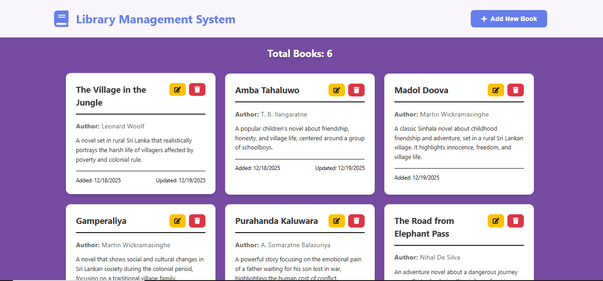

# 📚 Library Management System

A full-stack **Library Management System** built using **ASP.NET Core Web API** and **React with TypeScript**.
The system allows users to manage books efficiently with a clean homepage and CRUD functionality.

---



---

## ✨ Features

* 📖 View all books
* ➕ Add new books
* ✏️ Edit existing books
* ❌ Delete books
* 🔄 Real-time UI updates
* ⚠️ Form validation and error handling

---

## 🛠 Technologies Used

### Backend

* C# .NET 
* Entity Framework Core
* SQLite Database
* RESTful API architecture

### Frontend

* React (Vite)
* TypeScript
* Axios
* HTML, CSS

---

## 📋 Requirements

* .NET 6.0 SDK or later
* Node.js 16.x or later
* npm or yarn
* Git
* Visual Studio Code 

---

## ⚙️ Backend Setup
1. Clone the repository
2. Navigate to the backend directory
3. Install dependencies:

   ```bash
   dotnet restore
   ```
4. Build the project:

   ```bash
   dotnet build
   ```
5. Run the backend server:

   ```
   dotnet run
   ```
6. Backend will run at:

   ```
   http://localhost:5238
   ```

---

## ⚙️ Frontend Setup

1. Navigate to the frontend directory
2. Install dependencies:

   ```bash
   npm install
   ```
3. Start the development server:

   ```bash
   npm run dev
   ```
4. Frontend will run at:

   ```
   http://localhost:5173
   ```
5. Open the application in your web browser

---


